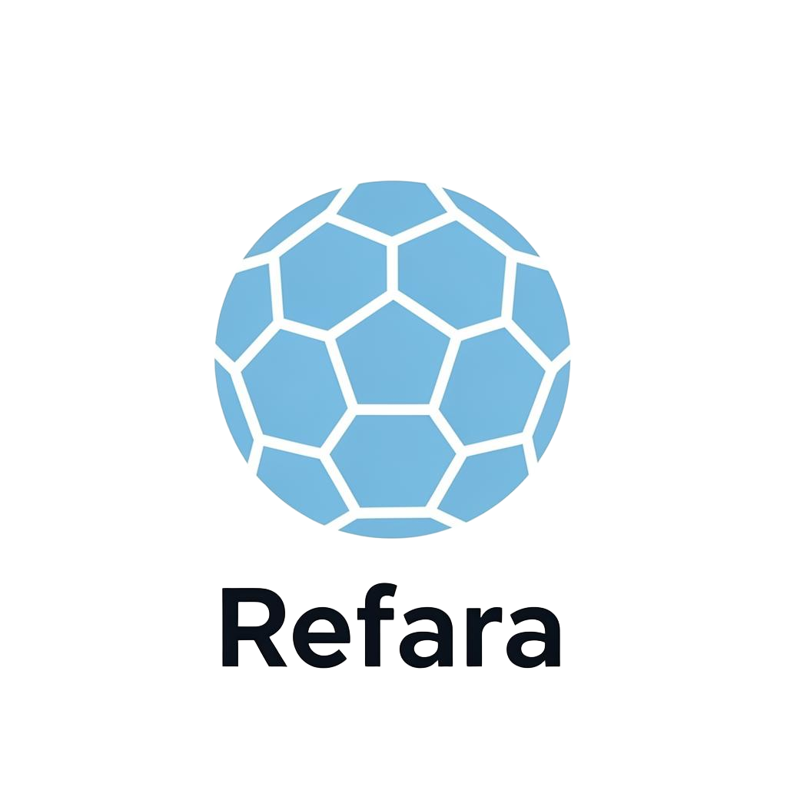

# Refara

	
		
	

AI soccer referee for foul incident clips.

Refara analyzes uploaded match footage and returns:
- foul decision
- restart decision (play on, free kick, penalty)
- card recommendation (none, yellow, red)

## Tech Stack

- Frontend: React + Vite + TypeScript
- Backend: Express + TypeScript

## Project Layout

- `src`: frontend app
- `backend`: API server
- `docs`: product and data documentation

## Quick Start

Frontend:
1. `npm install`
2. `npm run dev`

Backend:
1. `cd backend`
2. `npm install`
3. `cp .env.example .env`
4. `npm run dev`

Default backend URL: `http://localhost:4000`

## API

- `GET /api/health`
- `POST /api/analyses` (multipart form-data, file field: `clip`)
- `GET /api/analyses`
- `GET /api/analyses/:analysisId`

## Current Status

- Frontend flow is currently mock-driven.
- Backend upload + analysis job flow is scaffolded.
- Analysis service is currently mocked and ready for model inference integration.

## Documentation

- Training data and labeling guide: `docs/training-data-guide.md`
- Backend details: `backend/README.md`
